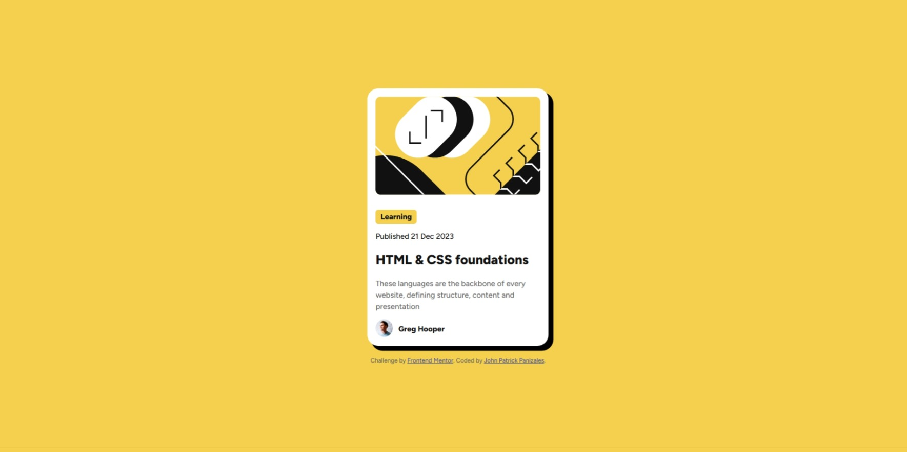
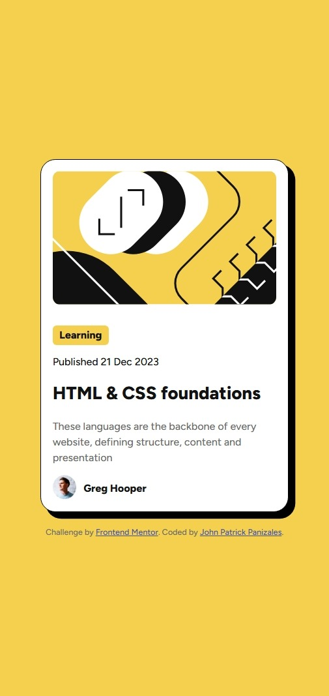

# Frontend Mentor - Blog preview card solution

This is a solution to the [Blog preview card challenge on Frontend Mentor](https://www.frontendmentor.io/challenges/blog-preview-card-ckPaj01IcS). Frontend Mentor challenges help you improve your coding skills by building realistic projects. 

## Table of contents

- [Overview](#overview)
  - [The challenge](#the-challenge)
  - [Screenshot](#screenshot)
  - [Links](#links)
- [My process](#my-process)
  - [Built with](#built-with)
  - [What I learned](#what-i-learned)
  - [Continued development](#continued-development)
- [Author](#author)

## Overview

### The challenge

Users should be able to:

- See hover and focus states for all interactive elements on the page

### Screenshot

### Links

- Solution URL: [Add solution URL here](https://your-solution-url.com)
- Live Site URL: [Add live site URL here](https://your-live-site-url.com)

## My process

### Built with

- Semantic HTML5 markup
- Flexbox
- Google Fonts

### What I learned

* reinforced my understanding of the concept of the CSS Box model
* using Google fonts via the link tag
* reinforced my understanding of how child elements use their parent elements' margin and padding as basis

### Continued development

* CSS styling is over the place. I don't have a system in implementing varying font-weights and font-styles. Styling is very literal and I need to learn how to style more effeciently.

## Author

- Frontend Mentor - [@Jppat](https://www.frontendmentor.io/profile/Jppat)