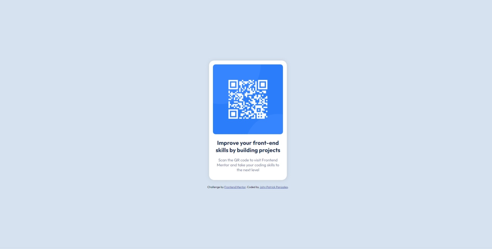

# Frontend Mentor - QR code component solution

This is a solution to the [QR code component challenge on Frontend Mentor](https://www.frontendmentor.io/challenges/qr-code-component-iux_sIO_H). Frontend Mentor challenges help you improve your coding skills by building realistic projects. 

## Table of contents

- [Overview](#overview)
  - [Screenshot](#screenshot)
  - [Links](#links)
- [My process](#my-process)
  - [Built with](#built-with)
  - [What I learned](#what-i-learned)
  - [Continued development](#continued-development)
- [Author](#author)

## Overview

### Screenshot

### Links

- Solution URL: [See repo in Github](https://github.com/Jppat/frontend_mentor/tree/main/qr-code-component-main)
- Live Site URL: [QR Code Component](https://jppat.github.io/frontend_mentor/qr-code-component-main/index.html)

## My process

### Built with

- HTML
- CSS
- Flexbox

### What I learned

I am coming from an Odin Project background. I have been taking the Web Development Foundations course, and in this challenge I mostly applied
all that I have learned from the mentioned course/curriculum.

1. HTML structure - When it comes to structuring HTML, I haven't yet established a mental framework to follow, however, currently I just like to group 
related things together under one div.

2. CSS - When I was early in learning the Odin Project curriculum, I learned that when no width is set, containers take the space of its contents. However,
I never really got a firm hold on that knowledge. That's why I had a bit of trouble trying to center the card on the screen. 

  Setting the margins to auto only centered the card horizontally. So, I added borders to see more clearly what was going on, and that's when I realized that the container was only taking the vertical space taken by the card. After that, I set the width of the body to 99vh to take up the whole viewport space. For some reason, setting it to 100vh took space a little beyond what I can see on the screen. I haven't yet done my research why this happens.

3. Flexbox - this challenge also gave me an opportunity to play around with some basic concepts related to flexbox, such as setting the flex-direction, as well as using the flex shorthand.

If you want more help with writing markdown, we'd recommend checking out [The Markdown Guide](https://www.markdownguide.org/) to learn more.

### Continued development

I did the challenge without much thought abour responsiveness, the only concept I used related to this is setting the card's max-width.

## Author

- Frontend Mentor - [@Jppat](https://www.frontendmentor.io/profile/Jppat)