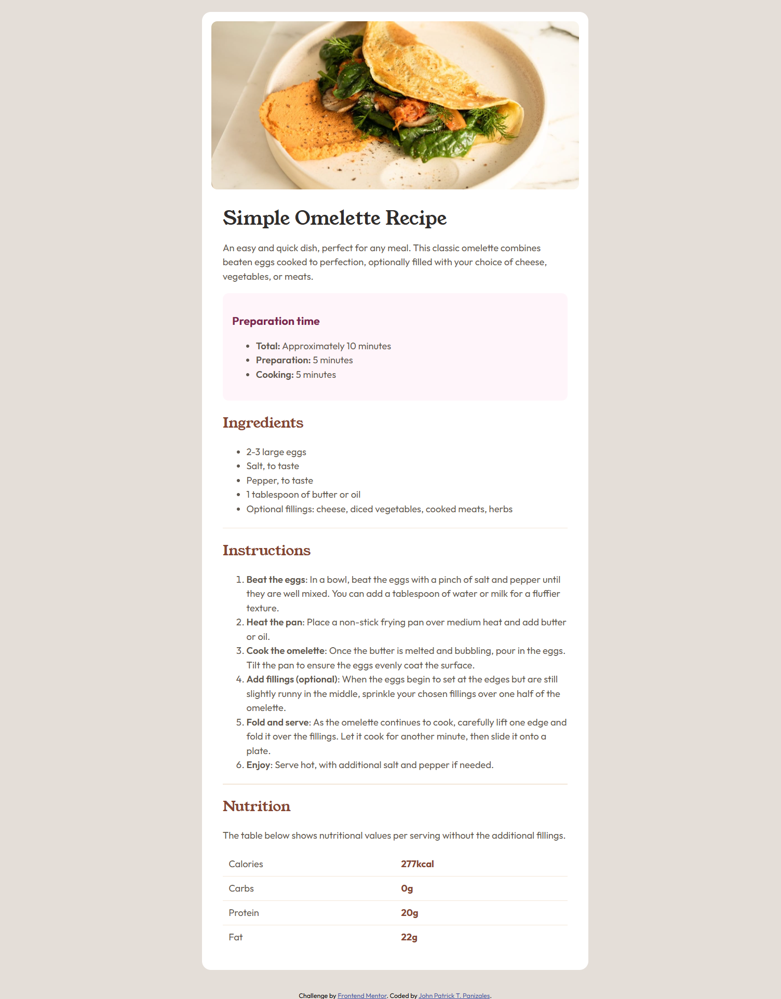
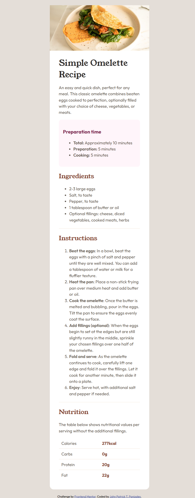

# Frontend Mentor - Recipe page solution

This is a solution to the [Recipe page challenge on Frontend Mentor](https://www.frontendmentor.io/challenges/recipe-page-KiTsR8QQKm). Frontend Mentor challenges help you improve your coding skills by building realistic projects. 

## Table of contents

- [Overview](#overview)
  - [The challenge](#the-challenge)
  - [Screenshot](#screenshot)
  - [Links](#links)
- [My process](#my-process)
  - [Built with](#built-with)
  - [What I learned](#what-i-learned)
  - [Continued development](#continued-development)
- [Author](#author)

## Overview

### Screenshot

<!--  -->
#### Desktop


#### Mobile
<!--  -->



### Links

- Solution URL: [Github](https://github.com/Jppat/frontend_mentor/tree/main/recipe-page-main)
- Live Site URL: [Recipe Page by Jppat](https://jppat.github.io/frontend_mentor/recipe-page-main)


## My process

### Built with

- Semantic HTML5 markup
- Flexbox

### What I learned

- Applied semantic html elements such as main and section.
- Learned that setting height: 100vh can cut elements on the page. Using min-height avoids that.
- Added custom fonts using ```css @font-face``` as I learned from another user.
- Used custom css variables.
- Got to work with HTML tables
- It's incredibly helpul to keep in mind the basic relationship of each tag/element, 
i.e., parent-child relationships. This makes it easier to debug designs.

### Continued development

- To be more comfortable with using em or rem for sizes.

## Author
- Frontend Mentor - [@Jppat](https://www.frontendmentor.io/profile/Jppat)