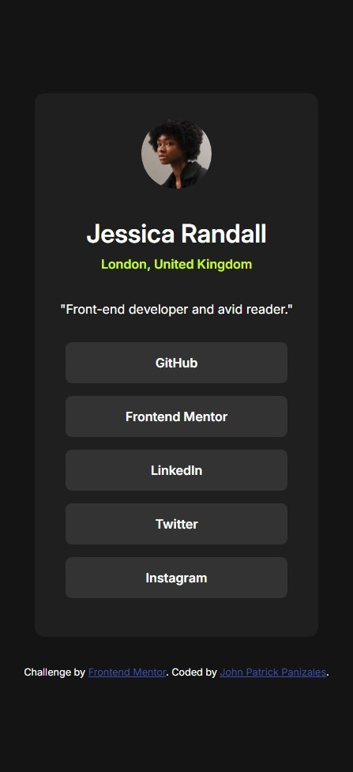

# Frontend Mentor - Social links profile solution

This is a solution to the [Social links profile challenge on Frontend Mentor](https://www.frontendmentor.io/challenges/social-links-profile-UG32l9m6dQ). Frontend Mentor challenges help you improve your coding skills by building realistic projects. 

## Table of contents

- [Overview](#overview)
  - [The challenge](#the-challenge)
  - [Screenshot](#screenshot)
  - [Links](#links)
- [My process](#my-process)
  - [Built with](#built-with)
  - [What I learned](#what-i-learned)
  - [Useful resources](#useful-resources)

## Overview

### The challenge

Users should be able to:

- See hover and focus states for all interactive elements on the page

### Screenshot

### Desktop

### Mobile

### Links

- Solution URL: [Github](https://your-solution-url.com)
- Live Site URL: [Live site](https://jppat.github.io/frontend_mentor/social-links-profile-main/index.html)

## My process

### Built with

- HTML5
- CSS
- Flexbox

### What I learned

- I learned mostly about how flexbox works

### Useful resources

- [Josh Comeau's interactive guide to flexbox ](https://www.joshwcomeau.com/css/interactive-guide-to-flexbox/) - This helped me for better understand how flexbox works.

## Author

- Frontend Mentor - [@Jppat](https://www.frontendmentor.io/profile/Jppat)